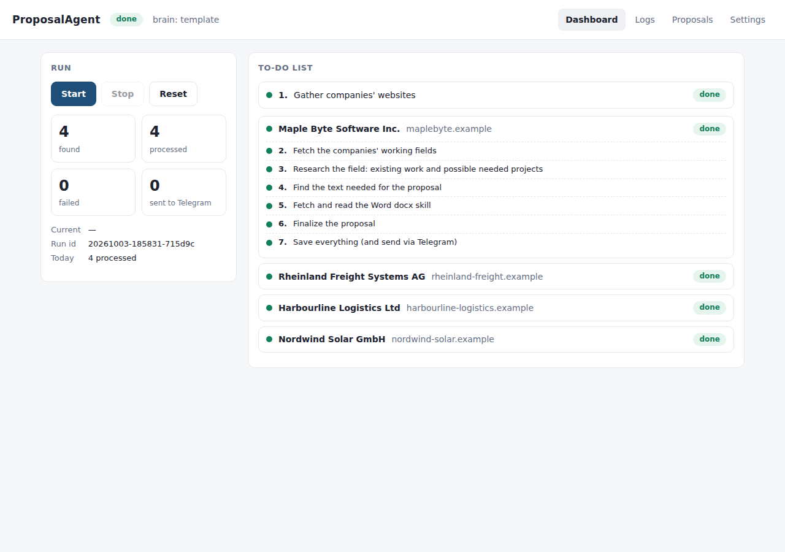

# ProposalAgent

An app with a **Start** button. An agent finds company websites, works out each company's field,
researches that field (existing work, trends, gaps), selects the projects the company most likely needs,
writes a complete project proposal as a `.docx`, and sends it with a JSON record and logs to a
Telegram bot.

The brain is **our own decoder-only transformer** (1.0 B parameters in the `1b` preset), trained from
random initialisation with our own BPE tokenizer on cleaned public datasets. No pretrained weights and
no external LLM calls. Every decision goes through **SRLM** (Self-Reflective Program Search): context
lives in a sandboxed Python REPL, the model writes K candidate programs that read it, and the winner
is chosen by self-consistency, verbalized confidence and trace length.



* Architecture, data flow and training budget: [`docs/ARCHITECTURE.md`](docs/ARCHITECTURE.md)
* Decisions: [`docs/DECISIONS.md`](docs/DECISIONS.md) · Phase reports and metrics: [`docs/PHASE_REPORTS.md`](docs/PHASE_REPORTS.md)
* Datasets and licenses: [`data/MANIFEST.md`](data/MANIFEST.md) · Cleaning report: [`data/reports/cleaning_report.md`](data/reports/cleaning_report.md)

## 1. Quick start (one command)

| OS | Command |
|---|---|
| Linux / macOS | `./run.sh` |
| Windows | double-click `run.bat` (or `powershell -ExecutionPolicy Bypass -File run.ps1`) |

The script installs everything that is missing, then starts the app and opens http://127.0.0.1:8000.
It installs Python 3.10+ if needed (apt/dnf/brew or winget), creates a virtualenv, and installs
PyTorch (the CUDA build when `nvidia-smi` is present, otherwise CPU) plus all packages. It also
installs docx-js if Node is available and creates `.env`. Re-runs are fast, because packages are
reinstalled only when `requirements.txt` changes.

Then, in the browser:
1. **Telegram card:** create a bot with [@BotFather](https://t.me/BotFather) (`/newbot`), paste the token, and press **Connect bot**.
2. Open the bot link that appears and press **Start** in Telegram. The app pairs with that chat automatically.
3. Press **Start** in the app. The heartbeat begins: the agent works through its to-do list, sends each proposal
   to Telegram, then waits `run_interval_minutes` and starts the next run, until you press **Stop**.
   A status message arrives every `heartbeat_minutes`.

From Telegram you can also send `/run`, `/stop`, `/status` and `/logs`. Only the paired chat is obeyed.

Useful options:

| Option | `run.sh` | `run.bat` / `run.ps1` |
|---|---|---|
| run detached / stop | `--background` / `--stop` | `-Background` / `-Stop` |
| custom port or host | `--port 9000 --host 0.0.0.0` | `-Port 9000 -HostName 0.0.0.0` |
| demo without internet | `--offline` | `-Offline` |
| update from git first | `--update` | `-Update` |
| run the tests | `--test` | `-Test` |
| train the tiny model on CPU (~15 min) | `--smoke-train` | `-SmokeTrain` |

Manual setup, if you prefer:

```bash
python3.11 -m venv .venv && . .venv/bin/activate
pip install -r requirements.txt && npm install && cp .env.example .env
python -m pytest            # offline tests; PA_NETWORK_TESTS=1 also runs the real-internet test
python -m app               # UI
python -m agent run [--offline] [--continuous]   # headless
```

## 2. Configuration (nothing is hard-coded)

All behaviour is set in `config.yaml`. This includes search and research endpoints, query
templates, the industry→Wikidata keyword map, country ids, politeness limits, SRLM switches,
budget bands, timeline, team roles, Telegram limits and heartbeat, continuous mode and log
sizes. Override any key with `PA__SECTION__KEY=value` or on the UI settings page (saved to
`config.override.yaml`). Secrets (bot token, chat id) live only in `.env`, and the Telegram card
writes them for you.

Company search uses **Wikidata** by default: open data listing each company's country, industry
and official website. Other search providers are `duckduckgo` (often bot-challenged from servers),
`seedfile` (your own list) and `offline`. Field research uses the Wikipedia API. Sites that block
bots or have broken TLS are skipped, and a reserve company takes their place (`agent.reserve_companies`).

`agent.policy: model` uses the checkpoint at `agent.checkpoint`. Until that checkpoint exists, the
agent falls back to the deterministic `template` policy and logs that it did. This is the same
programmatic generator that produces the training traces.

## 3. Data → tokenizer → pretraining → agent SFT

```bash
# 1. Download public datasets (resumable, checksummed; writes data/MANIFEST.md)
python -m data.download --groups general business agentic --max-docs 20000000
# 2. Clean: normalize → language ID → quality + perplexity → MinHash dedup → PII/toxicity → decontamination
python -m data.clean.pipeline --workers 32
# 3. Tokenizer (48k BPE + agent special tokens) and stage 7 shards
python -m tokenizer.train
python -m data.clean.shard
# 4. Pretrain the 1B model (8K context). Resume-safe: re-run with --resume after any interruption.
torchrun --nproc_per_node 8 -m training.pretrain --preset 1b --resume
# 5. Synthetic SRLM traces with calibrated confidence, then agent-format SFT
python -m agent.synth.generate --companies 20000 --k 4
python -m training.sft --init training/checkpoints/pretrain/latest.pt
# 6. Evaluate: step format, ECE, field accuracy; ablations
python -m training.eval --checkpoint training/checkpoints/sft/latest.pt
python -m training.ablation --policy model --k 8
```

Budget for the full 1B run: 20 B tokens, 76.3 k steps of 262 k tokens. That is about 6 days on
1×H100, 18 days on 1×A100, or 2.5 days on 8×A100. Details are in `docs/ARCHITECTURE.md` §6.

The whole pipeline on CPU in about 15 minutes (tiny 6.9 M-parameter preset, bundled sample corpus):

```bash
./scripts/smoke_pipeline.sh
```

## 4. SRLM switches (`config.yaml → srlm`)

| Key | Default | Meaning |
|---|---|---|
| `K` | 8 | candidate programs per decision unit (run in parallel) |
| `temperature`, `top_p` | 0.8, 0.95 | sampling diversity |
| `max_steps`, `step_timeout_s` | 30, 60 | per-candidate step and per-step time limits |
| `use_self_consistency` / `use_verbalized_confidence` / `use_trace_length` | true | ablation switches |
| `use_subcalls` | false | optional recursive `sub_call` (ablation only) |
| `direct_baseline` | false | single program, no selection |
| `min_score`, `min_prob`, `max_retries` | -400, 0.25, 1 | retry, then "Not verified" |
| `set_agreement_threshold`, `agreement_threshold` | 0.8, 0.6 | agreement for list and free-text outputs |

## 5. Outputs and logs

* `outputs/proposals/<date>_<domain>.docx`: cover, table of contents, 17 sections, tables, page X of Y.
  Every factual sentence cites `[S#]`; anything unsupported says "Not verified".
* `outputs/records/<date>_<domain>.json`: profile, evidence with URLs, projects, sections, SRLM decision summaries.
* `logs/agent.log`, `tools.log`, `training.log`, `errors.log`: human-readable, one line per event
  (`timestamp | run_id | company | step | tool | status | duration | details`), each with a `.jsonl` twin.
* `logs/srlm.jsonl`: every decision unit (all candidates' code, outputs, confidences, VC, Len, s(p),
  prob(a), consistent set, selection, retries, wall-clock) and every model prompt/output step.
* `outputs/state.json`: persistent run state (crash recovery and resume).

## 6. Troubleshooting

| Symptom | Fix |
|---|---|
| `brain: template` in the UI | No SFT checkpoint at `agent.checkpoint`: train one (§3) or point the setting at it. |
| Telegram counter stays 0 | Connect the bot on the dashboard and press Start in its chat. The card shows "Connected". Use **Send test** to check, and see `logs/tools.log` for errors. |
| Telegram card stuck on "press Start" | Open the bot link shown and press Start (or send `/start`). If the bot has a webhook set, the app removes it automatically. |
| Search finds nothing | Check `errors.log`. With `duckduckgo`, a bot challenge is reported as `SearchBlocked`, so switch to `wikidata` or `seedfile`. |
| Agent keeps running after a run finishes | That is continuous mode (`agent.continuous`). Press Stop, or turn it off in Settings. |
| `run.bat` closes immediately | Run `powershell -ExecutionPolicy Bypass -File run.ps1` in a terminal to see the error. |
| Docx falls back to python-docx | Run `npm install` (needs Node 18+). Both backends produce the same structure. |
| `HTTP 403` / `CONNECT tunnel failed` | Your network or proxy blocks the host; allow it or use offline providers. |
| Stopped or crashed mid-run | Press **Start** (Resume): finished steps are reused from `outputs/cache/work/<domain>/`. **Reset** starts fresh. |
| Daily limit reached | `agent.daily_limit` counts companies per calendar day; raise it or wait. |
| Sandbox `SandboxViolation` in logs | A program tried a blocked import or attribute. It is expected in candidate programs and logged, not fatal. |
| Out of GPU memory | Lower `training.micro_batch_size`, raise `grad_accum_steps`, keep `grad_checkpointing: true`, or train at `--seq-len 2048` first. |
